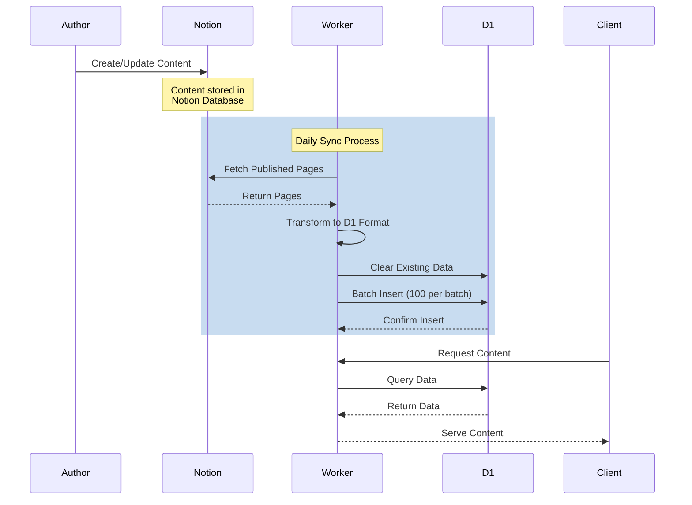

# Notion D1 Worker

A high-performance content sync system that automatically synchronizes content from Notion to Cloudflare D1, enabling you to use Notion as a CMS while leveraging Cloudflare's edge database for content delivery. Features AI-powered content enhancement including automatic summarization, tag generation, and technical illustrations.

## What This Project Does

This project creates a bridge between Notion and Cloudflare D1, allowing you to:

1. Use Notion as your Content Management System (CMS)
2. Automatically sync content to Cloudflare's edge database (D1)
3. Serve content globally with ultra-low latency
4. Stay within Cloudflare's free tier limits
5. Generate AI-powered content enhancements:
   - Automatic content summarization
   - SEO-optimized tag generation
   - Technical illustrations for posts

## Tech Stack

- **Runtime**: [Bun](https://bun.sh) - A fast all-in-one JavaScript runtime
- **Infrastructure**:
  - [Cloudflare Workers](https://workers.cloudflare.com/) - Serverless edge computing
  - [Cloudflare D1](https://developers.cloudflare.com/d1/) - SQLite at the edge
- **API Integration**:
  - [Notion API](https://developers.notion.com/) - Content management
  - [Deepseek](https://deepseek.com) - AI text generation
  - [DashScope](https://dashscope.aliyun.com) - AI image generation
- **Language & Type Safety**:
  - [TypeScript](https://www.typescriptlang.org/) - Type-safe development
- **Testing**:
  - Integration tests using Bun's test runner

## How It Works

1. **Content Creation**: Authors create and manage content in Notion
2. **Automated Sync**: The worker runs daily (configurable) to:
   - Fetch published content from Notion
   - Transform content to D1-compatible format
   - Sync to Cloudflare D1 database
3. **Content Delivery**: Content is served from Cloudflare's edge network

## Workflow & Architecture

The system follows a straightforward sync workflow:



## Prerequisites

Before you begin, ensure you have:

1. A [Cloudflare account](https://dash.cloudflare.com/sign-up) (free tier is sufficient)
2. A [Notion account](https://www.notion.so/) with a root page for content
3. [Bun](https://bun.sh) installed on your machine
4. API keys for AI services:
   - [Deepseek API](https://deepseek.com) for text generation
   - [DashScope API](https://dashscope.aliyun.com) for image generation

## Quick Start

1. **Clone and Install**

   ```bash
   git clone https://github.com/tonglam/notion-d1-worker.git
   cd notion-d1-worker
   bun install
   ```

2. **Set Up Notion Integration**

   - Go to [Notion Integrations](https://www.notion.so/my-integrations)
   - Create a new integration
   - Copy the integration token
   - Share your root page with the integration
   - Copy your root page ID from the page URL

3. **Configure Environment**

   ```bash
   cp .env.example .env
   cp .dev.vars.example .dev.vars
   ```

   Required Keys:

   ```env
   # In .dev.vars (local development)
   NOTION_TOKEN=your_notion_integration_token
   NOTION_ROOT_PAGE_ID=your_notion_root_page_id
   DASHSCOPE_API_KEY=your_dashscope_api_key
   DEEPSEEK_API_KEY=your_deepseek_api_key

   # In .env (deployment)
   CLOUDFLARE_ACCOUNT_ID=your_cloudflare_account_id
   CLOUDFLARE_API_TOKEN=your_cloudflare_api_token
   ```

4. **Set Up Cloudflare**

   ```bash
   # Configure production secrets
   wrangler secret put NOTION_TOKEN
   wrangler secret put NOTION_ROOT_PAGE_ID
   wrangler secret put DASHSCOPE_API_KEY
   wrangler secret put DEEPSEEK_API_KEY

   # Create D1 database
   wrangler d1 create notion-posts

   # Initialize database schema
   wrangler d1 execute notion-posts --file=./db/schema.sql
   ```

5. **Development & Deployment**

   ```bash
   # Run locally
   bun run dev

   # Deploy to Cloudflare
   bun run deploy

   # Run tests
   bun test
   ```

## Project Structure

```
notion-d1-worker/
├── src/               # Source code
│   ├── index.ts      # Entry point
│   ├── services/     # Core services
│   │   ├── notion.ts # Notion integration
│   │   ├── d1.ts    # D1 database operations
│   │   ├── sync.ts  # Sync orchestration
│   │   ├── ai.ts    # AI service integration
│   │   └── ai/      # AI-specific modules
│   ├── types.ts      # Type definitions
│   └── utils/        # Utility functions
├── db/               # Database files
│   └── schema.sql    # D1 schema
├── test/             # Integration tests
└── documentation/    # Project documentation
```

## AI Features

The project includes several AI-powered enhancements:

1. **Content Summarization**

   - Automatically generates concise summaries of articles
   - Uses Deepseek's advanced language model
   - Optimized for technical content

2. **Tag Generation**

   - Extracts relevant keywords and keyphrases
   - SEO-optimized tag suggestions
   - Configurable number of tags

3. **Technical Illustrations**
   - Generates professional technical diagrams
   - Clean, minimalist style
   - Text-free visual representations

## Limitations & Considerations

- Runs once per day (configurable)
- Processes posts in batches of 100 (free tier limit)
- Only syncs published posts
- Uses clear-and-replace sync strategy
- Operates within service limits:
  - 100,000 D1 reads per day
  - 1,000 D1 writes per day
  - 100,000 Worker requests per day
  - AI service rate limits apply
  - Image generation quotas based on DashScope plan

## Security Best Practices

- Never commit `.env` or `.dev.vars` files
- Use `wrangler secret` for production credentials
- Keep API tokens secure
- Follow least-privilege principle for integrations
- Regularly rotate API tokens
- Secure AI service credentials
- Monitor AI service usage and costs

## License

MIT
